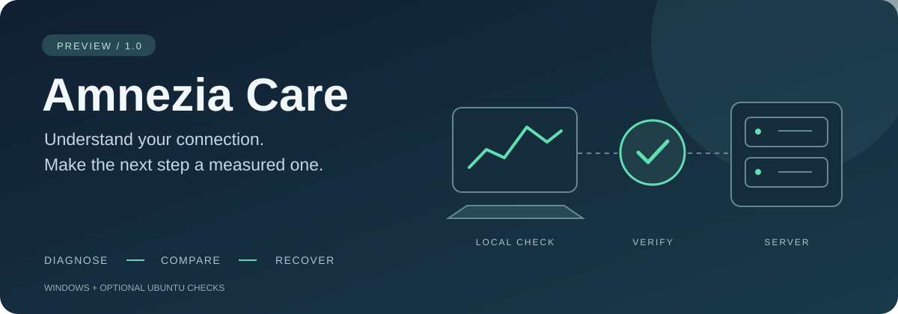

# Amnezia Care

**������, ��祬� ChatGPT � Claude �ମ��� �१ VPN. �஢���� ᮥ�������. ��ࠢ��� ���⢥ত�� ��७��ࠢ����� � hosts � १�ࢭ�� ������.**

����⨢�� ����� ��� Windows � ����易⥫쭮� �������⨪� Ubuntu / AmneziaWG � Docker. ��� ��⠭���� ����ﭭ�� �㦡 � ��� ��ࠢ�� ����⮢ ࠧࠡ��稪�.

> **�����: �।���⥫쭠� ����� 1.0. ����� ����� ������ ��⠭��騪� �� Windows ��� �� �஢�७.**
> �஢�ઠ ᨭ⠪�� � ᮢ������� ���஥���� 䠩��� �� ������� ���⠭�� ��⠭����, ����襭�� �ࠢ, �⥢�� �஢�ப � �⪠� �� ॠ�쭮� ��⥬�. ����� �業�਩ Windows + VPS ⠪�� �� �஢�७.

[������ ZIP](https://github.com/voodysan1/amnezia-care/archive/refs/heads/main.zip) � [������ ��⠭��騪](https://raw.githubusercontent.com/voodysan1/amnezia-care/main/Install-AmneziaCare.ps1) � [��� �� ࠡ�⠥�](#���-��-ࠡ�⠥�) � [�⪠�](#�⪠�) � [������ ����](CASE-STUDY.md)

������ᨬ�� �⨫�� ᮮ���⢠; �� ��樠��� �த�� ������� Amnezia.

## ���砫� - ⮫쪮 �������⨪�

1. [���砩� ZIP](https://github.com/voodysan1/amnezia-care/archive/refs/heads/main.zip) � �ᯠ��� ��� 楫����.
2. ������ ᢮� ����� AmneziaVPN. ����� ᠬ �� ��४��砥� �ࢥ�� � �� ������砥� VPN.
3. ��ன� **Windows PowerShell �� ����� �����������**. ��३��� � �ᯠ�������� ����� �१ `cd "������_����_�_�����"`.
4. �믮����:

```powershell
powershell.exe -NoProfile -ExecutionPolicy Bypass -File .\Care.ps1 -DiagnoseOnly
```

� �⮬ ०��� ��⥬�� ����ன�� �� ��ࠢ������. ��������� ������� ������; �� �롮� SSH ��࠭���� ������ ���� �ࢥ� � �믮������� �ࢥ�� �஢�ન. ������ **Enter**, �⮡� �ய����� ����� SSH.

�� ����讬 䠩�� `hosts` �஢�ઠ ����� ������ ��᪮�쪮 �����: ������ �஢������� ��᫥����⥫쭮. ����� `SUMMARY.txt` � `https.json` � ����� �����.

## ����� � ��ࠢ������

��� ०�� **����� �������� hosts � ������ ��� DNS** ��᫥ �஢�ப. �ᯮ���� ��� �ᮧ�����, ��᫥ ��ᬮ�� ���� � १���⮢ �������⨪�.

### ��ਠ�� A: ���� 䠩� ��⠭��騪�

[���砩� Install-AmneziaCare.ps1](https://raw.githubusercontent.com/voodysan1/amnezia-care/main/Install-AmneziaCare.ps1). �᫨ ��㧥� �����뢠�� ⥪��, ��࠭�� ��� ��� 䠩� � ���७��� `.ps1`, � �� `.txt`. � PowerShell, ��室��� � ����� ᪠稢����, �믮����:

```powershell
powershell.exe -NoProfile -ExecutionPolicy Bypass -File .\Install-AmneziaCare.ps1
```

��⠭��騪 ������ �ࠢ� �����������, ������ ���஥��� 䠩�� � `%LOCALAPPDATA%\AmneziaCare\tool` � **�ࠧ� ������� �஢��� � �������� ��ࠢ������**. �� �� ᪠稢��� �������⥫�� ���. ����ୠ� ��⠭���� ��१����� 䠩�� � ����� `tool`.

### ��ਠ�� B: �ᯠ������� ZIP

������ �ࠢ�� ������� �� **Start.cmd  ����� �� ����� �����������**, ���� �믮���� � PowerShell �����������:

```powershell
powershell.exe -NoProfile -ExecutionPolicy Bypass -File .\Care.ps1
```

��᫥ ��ࠢ����� ��१������ ��㧥� ��� �ਫ������, �⮡� �������� �������騥 ᮥ�������.

## ��� �� ࠡ�⠥�

| ��� | ����⢨� |
| --- | --- |
| �������⨪� | ����ﭨ� Windows, �������, ����, ��������, DNS, �ப�, IPv6, ��䨫� �࠭������ � HTTPS-�஡�. |
| �ࠢ����� | ����� HTTPS-����� � ��� ����� � IP �� DNS ��⨢���� ������ Amnezia � ��࠭����� ����� ᠩ� � �஢�ન ���䨪��. |
| ��襭�� | ��ࠢ����� ⮫쪮 ��� �������� ��७��ࠢ�����, �᫨ ��� ���� �஡� ���� HTTP 2xx/3xx � ����॥ ��室��� ������ �� 20%, ���� ��室��� �஡� �� ���� 2xx/3xx. |
| ����ࢭ�� ����� | ���࠭���� ��室���� 䠩�� ��। �������஢����� ���室��� ��ப. |
| �஢�ઠ ��᫥ | ����ୠ� HTTPS-�஡�. �� �� ���ᯥ� - ����⠭������� ��室���� 䠩�� 楫����. |

��ࠡ��뢠���� ⮫쪮 ������� ����� ������� OpenAI/ChatGPT � Anthropic/Claude, ������ `oaistatic.com` � `oaiusercontent.com`, �� **��� �������� �㡫���� ���� ��७��ࠢ�����**. �� IP - ���������᪨� �ਧ���� � ����, � �� ���� ����� VPN-�ࢥ஢.

��� ��⨢���� ������, � ����� ���ண� ���� `Amnezia`, ��� IPv4 DNS ��� �ᯥ��� ����� �஡ ��ࠢ����� �� �믮������. ��㣨� ����� VPN-����䥩ᮢ ����� �� �ᯮ���������. IP �ࢨᮢ �� ���९������: ��� ����訢����� ������.

HTTP 401/403 �� ��⠥��� �ᯥ譮� ��אַ� �஡��. ��������� IP, ����� � ��᪮�쪨�� ������� � ��⠫�� �ࢨ�� ��࠭�����. ��� ��࠭�� ��室�� ����� � ��ॢ��� ��ப; �� �६� �஢�ન �� ।������ `hosts` ��㣨�� �ணࠬ����.

### �࠭��� �஢�ન

- HTTPS-�஡� �ᯮ����� IPv4 � ��室�� �ப� ⮫쪮 ��� ᮡ�⢥���� ����ᮢ (`curl --noproxy '*'`); �� �� ����� ����ன�� �ப� Windows.
- ��������� �⢥� �� `/`, ��� �室� � ������, JavaScript � ����㧪� �ᥩ ��࠭���.
- ��� �����業���� ��� WebSocket, ᪮��� �����樨, �ய�᪭�� ᯮᮡ���� ��� ����� ����⮢.
- �ᯥ�� HTTP-�⢥� �� ��࠭���� ࠡ��� ��� �㭪権 �ਫ������.
- �ணࠬ�� �� ��४��砥� VPN, �� ����� ��������, DNS-�ࢥ��, MTU, firewall, ���䨪��� ��� QoS.

## ��� �᪠�� १����

�� ��� �⭮����� � ���⭮� �����, ��� ���ன ����饭� �ணࠬ��:

```text
%LOCALAPPDATA%\AmneziaCare\
��� tool\                  䠩�� ��᫥ ��⠭����
��� reports\����-ID\       १����� �஢�ப
��� reports\����-ID.zip    ��娢 �����
��� backups\               १�ࢭ� ����� hosts �� ��ࠢ�����
��� server.json            ���� SSH, ⮫쪮 �᫨ ��� �����
```

��筨� � `SUMMARY.txt`, `https.json` � `errors.txt`, �᫨ �� ᮧ���. `https-after.json` ������ ��᫥ �ᯥ譮� �஢�ન ���������; `server.txt` - �� �믮������ SSH-�஢�ન. ���������᪨� ZIP �� ���� १�ࢭ�� ������ �ࢥ�.

## �⪠�

� PowerShell �����������, �� ����� � `Care.ps1`, ����⠢�� **����������** १�ࢭ�� ����� �� `%LOCALAPPDATA%\AmneziaCare\backups`:

```powershell
powershell.exe -NoProfile -ExecutionPolicy Bypass -File .\Care.ps1 -Restore "$env:LOCALAPPDATA\AmneziaCare\backups\hosts-����-ID.backup"
```

�⪠� ������� `hosts` 楫���� � ��頥� ��� DNS. ����騩 䠩� ��। ����⠭�������� ��࠭���� � ����� ��⠫��� �����. �᫨ ��᫥ १�ࢨ஢���� �� ������ ��㣨� ���������, ᭠砫� �ࠢ��� 䠩��.

## ����易⥫쭠� �஢�ઠ Ubuntu-�ࢥ�

������ `���짮��⥫�@�ࢥ�`, ����� ����� �����, ���� ������ Enter ��� �ய�᪠. ������ ���� ��࠭���� �����쭮 ��� ᫥����� ����᪮�. SSH �ᯮ���� ��� �������騩 �����; ��஫� �� ��࠭����. ������ �⯥�⮪ ������ SSH-��� � ����묨 �஢�����.

�������� �⠥� ���ﭨ� ����䥩ᮢ, ������⮢, firewall, Docker, DNS � ��ॣ�஢���� ����稪� peers. �� ���㦠�� ���� � VPN-���䨣�. �ࠢ� root �㦭� ��� ������� ����� �஢�ப; �訡�� ����㯠 ��࠭����� � �����. �������騥 �����㬥��� �� ��⠭����������.

�� �ࢥ� �६���� ��������� �ਯ�, ����� 㤠����� ��᫥ ��⭮�� �����襭�� SSH-�������. �� ���뢥 �裡 �६���� 䠩� ����� �������. ��㦡� � �⥢� ����ன�� �ࢥ�� �������� �� �����.

��� ᠬ����⥫쭮�� ����᪠ ᪮����� ⮫쪮 `server-check.sh` �� ᢮� �ࢥ�:

```bash
bash server-check.sh
# ��� DNS/HTTPS-�஡:
bash server-check.sh --skip-probes
```

`amn0` ����� ���� ���⮬, � VPN-����䥩� - ��室����� ����� ���⥩���. `FORWARD DROP`, IPv6 ��� HTTP 403 ᠬ� �� ᥡ� �� �����뢠�� ����ࠢ�����. �஢�ઠ VPS �� ������� ᪮���� ������ � �� ��⠭�������� 䠪� ����⥫��⢠ �஢�����.

## �ॡ������

- Windows � **Windows PowerShell 5.1**, `curl.exe` � �ࠢ��� �����������.
- ��� SSH: `ssh.exe` � `scp.exe`; ��� �ࢥ� - Bash � `timeout`, ��⠫�� �����㬥��� ��� ᮮ⢥������� �஢�ப.
- `ExecutionPolicy Bypass` � �������� ������� ⮫쪮 ��� ����᪠����� �����. ����ﭭ�� ����⨪� �� �������. �᫨ ����� ������ �࣠����樮���� ����⨪��, ᮣ����� ��� � ����������஬.

## ���䨤��樠�쭮���

�㡫��� ����� ᮤ�ন� ��� � ������祭��� ���㬥����. ���� �ࢥ��, ����, ��஫�, ����, ���䨣��樨 VPN � ��室�� ���������᪨� ������ � �㡫����� �� ����祭�.

������ �� ��ࠢ������ ࠧࠡ��稪� ��� � GitHub. DNS/HTTPS-�஡� �������� � �஢��塞� �ࢨᠬ; ��࠭�� ���� �ࢥ� �஢������ �१ SSH. ������� ������, `server.json` � १�ࢭ� ����� `hosts` ����� ᮤ�ঠ�� ����, ����� ���ன�� � ����� �⥢�� ���ଠ��. **�� �ਪ���뢠�� �� � �㡫��� issues ��� ��筮�� ������稢����.**

## ���⠢ � �஢�ઠ

| ���� | �����祭�� |
| --- | --- |
| `Care.ps1` | �������⨪� Windows, �஢��塞�� ��ࠢ����� � �⪠�. |
| `Install-AmneziaCare.ps1` | ��⮭���� ��⠭��騪 � ���஥��묨 䠩����. |
| `Start.cmd` | ������ ����� �� ����� �����. |
| `server-check.sh` | �������� Ubuntu / Docker. |
| [CASE-STUDY.md](CASE-STUDY.md) | ������祭�� ࠧ��� ��室���� ����; �� ��࠭�� �᪮७��. |
| [PROMPT.md](PROMPT.md) | ���⥪�� ��� ���쭥�襩 ࠧࠡ�⪨. |

��। �㡫���樥� �஢������� ᨭ⠪�� PowerShell/Bash, ᮢ������� ���஥���� 䠩��� � ��㡫�������묨 � ������⢨� ����� ������ �� 蠡����� � ��筮�� ��ᬮ���. **����� ����� ������ ��⠭��騪� �� Windows ��� �� �஢�७.** �� ��⠩� ��� �।���⥫��� ����� ��襤襩 �����業�� ���⠭��.


